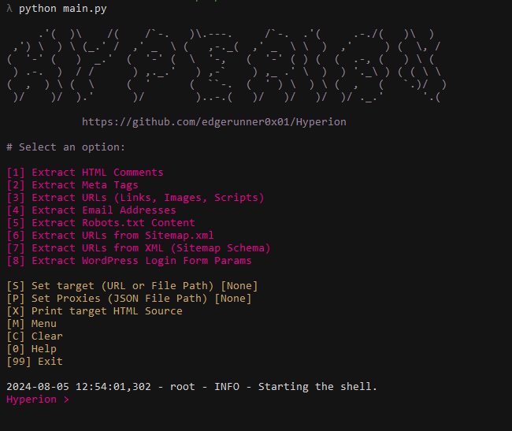

# Hyperion

## Overview

This tool is a shell interface designed to integrate the zProbe (https://github.com/edgerunner0x01/zProbe) Python module, enabling users to easily scrape and extract various types of data from web pages. With this interface, users can access functionalities to extract comments, metadata, URLs, emails, robots.txt, sitemap.xml, XML URLs, and WordPress login form parameters from a given URL.

## Features

-Extract Comments: Retrieve comments embedded in HTML.
-Extract Metadata: Collect metadata from web pages.
-Extract URLs: Gather all URLs present on a web page.
-Extract Emails: Find and extract email addresses.
-Extract Robots.txt: Retrieve and parse robots.txt files.
-Extract Sitemap.xml: Extract URLs from sitemap.xml files.
-Extract XML URLs: Gather URLs from XML files.
-Extract WP-Login Form Parameters: Extract parameters from WordPress login forms.
-Shell Interface: Interactive command-line interface for user-friendly interaction.
-OOP Design: Organized with object-oriented programming for better maintainability.
-Logging: Detailed logging for debugging and auditing.
-Error Handling: Robust error handling mechanisms.

### Screenshot



### Prerequisites

- Python 3.6 or higher
- pip

### Installation

1. Clone the repository:
    ```bash
    git clone https://github.com/edgerunner0x01/Hyperion
    cd Hyperion
    ```

2. Install the required packages:
    ```bash
    pip install -r requirements.txt
    ```

### Usage

Run the shell interface:
```bash
python main.py
```